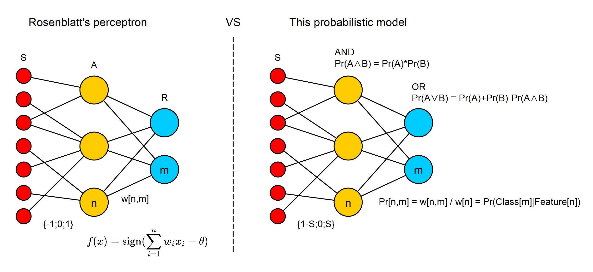

# neuron

Группа для вопросов: https://t.me/+GZS7XPBxQ4FmNzMy

## Содержимое репозитория
* Классификатор (neuron.go), моделирующий ассоциативную вероятностную импульсную нейронную сеть прямого распространения.  
В сети два слоя:
  * входной - признаки
  * выходной - классы

  Каждая связь в сети пропускает импульс с вероятностью, рассчитанной по теореме Байеса:  
  `W[n,m]=Pr(Class[m]|Feature[n])`  
  Выходной нейрон срабатывает с вероятностью:  
  `Pr(Class[m]|W[1,m] + W[2,m] + ... + W[n,m])`  
  рассчитанной по теореме сложения вероятностей совместных независимых событий:  
  `Pr(A+B)=Pr(A)+Pr(B)-Pr(A*B)`

  Сеть так же может иметь три слоя. В среднем слое нейроны (детекторы) выполняют функцию: `Pr(A*B)=Pr(A)*Pr(B)`  
  На вход эти нейроны могут получать инвертированные признаки.
  В сравнении с персептроном сеть выглядит так:
  
  
  Помимо пресинаптической пластичности, которая используется в данном классификаторе, возможна и постсинаптическая. Как AND нейрон распределяет свои выходы (вес исходящей связи / вес нейрона), так и OR нейрон может распределять свои входы (вес входящей связи / вес нейрона). Эти виды пластичности могут использоваться как по отдельности, так и одновременно при взаимодействии AND и OR нейронов, например, как в этом коде: https://github.com/tsukanov-as/neuron/blob/a25f34aeadd1a77c2febf73ae99774e5c7558191/neuron.go#L64
  
* Модель вероятностного импульсного нейрона (model.go, черновик)  
  Главная идея в том, что вещественные числа между нейронами передавать не требуется, их роль выполняет вероятность события.
  
  https://user-images.githubusercontent.com/17392154/234543158-f794cee9-6d06-47bc-9c18-a63ced5a5124.mp4

```sh
$ git clone https://github.com/tsukanov-as/neuron.git && cd neuron
$ go test -v -count=1 ./... -run ^TestModel$
$ go test -v -count=1 ./... -run ^TestAssociation$
$ go test -v -count=1 ./... -run ^TestDetection$
$ go test -v -count=1 ./... -run ^TestDetection2$
```
